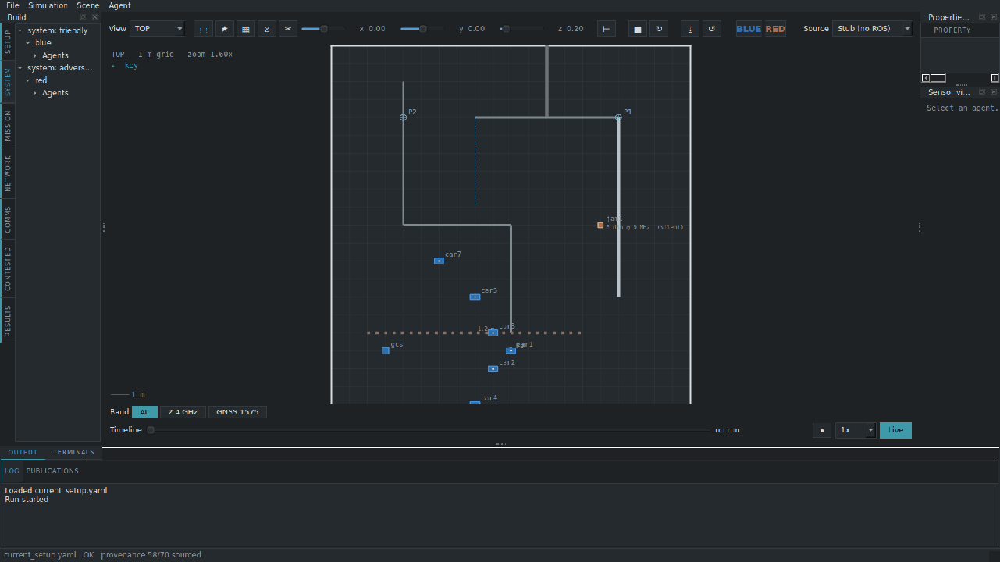
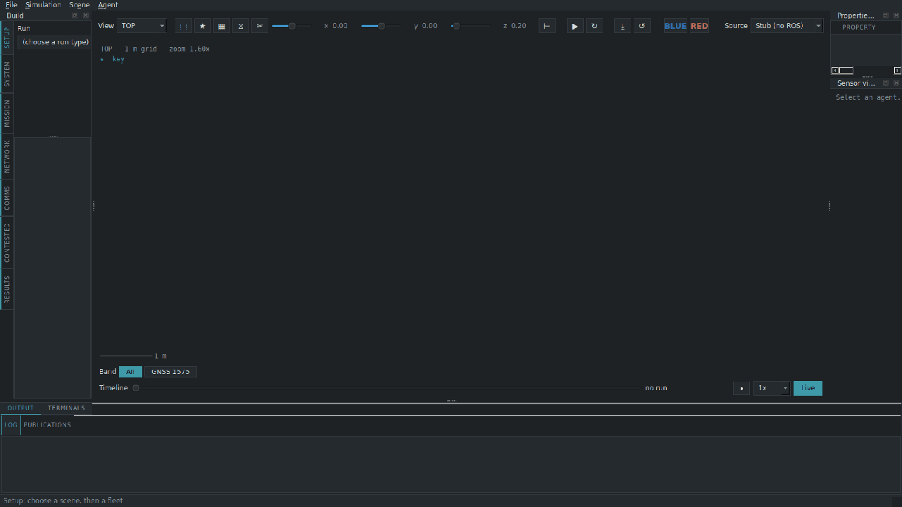
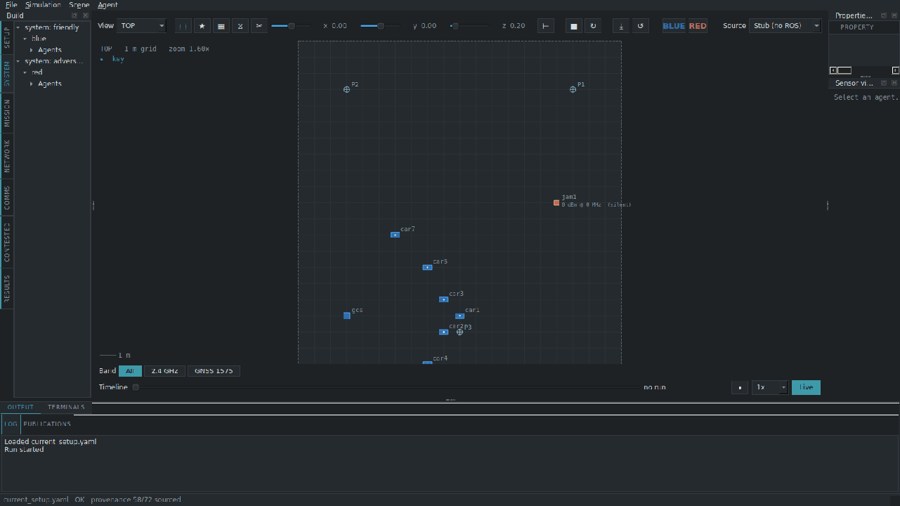
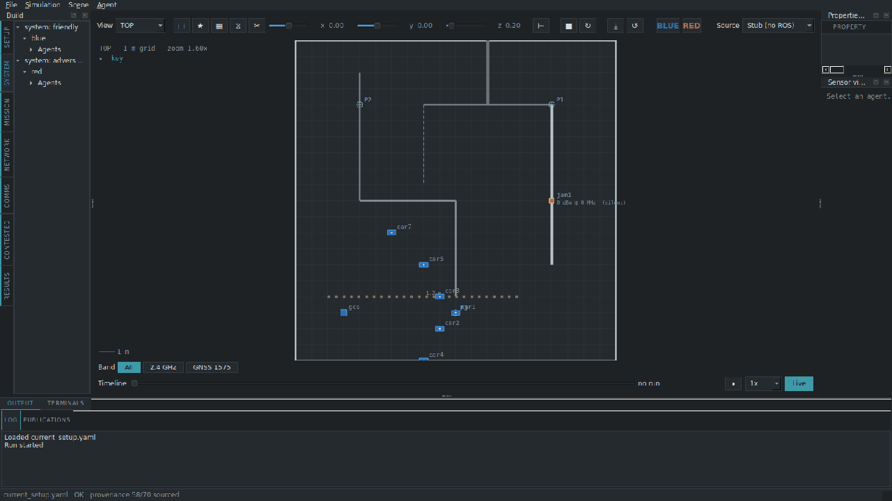
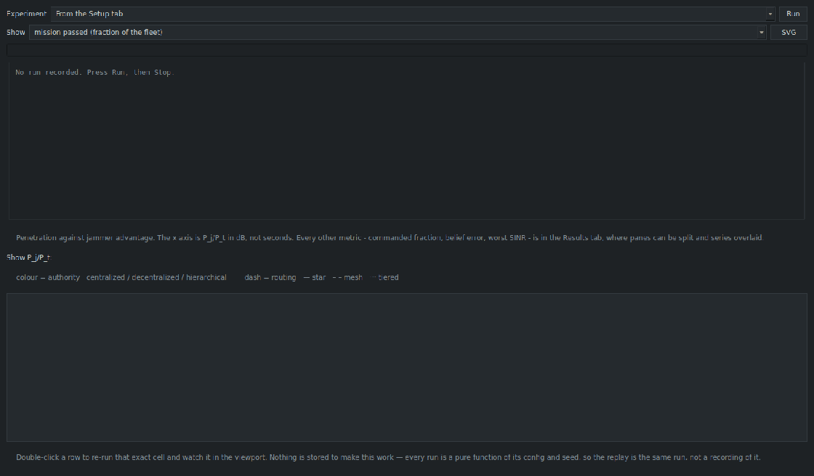

# CommsEv — Communications Evaluator

[](https://github.com/wjhurford/CommsEv/actions/workflows/tests.yml)
[](https://github.com/wjhurford/CommsEv/pkgs/container/commsev)
[](LICENSE)

A command-and-control resilience testbed for robot and drone fleets under
jamming and GNSS denial. It models one causal chain end to end:

> **RF physics → link state → command authority → agent behaviour →
> position knowledge → mission outcome**

Robotics simulators move vehicles and treat communications as free; network
simulators model the radio channel and do not move vehicles. CommsEv couples
the two, so that a change in the spectrum propagates to the mission outcome
without being wired in by hand.



Developed at Loughborough University (LUCAS Lab) by William Hurford, 2026,
under the supervision of Dr Chengyuan Liu. Formerly *Deadband*. Status:
research prototype — the model, the Console and the 561-check test suite are
operational; the API is not frozen.

## Run it

**In a browser, without a local Python installation** — requires [Docker Desktop](https://www.docker.com/products/docker-desktop/):

```bash
docker run --rm -p 5800:5800 ghcr.io/wjhurford/commsev     # prebuilt image
docker compose up        # or build from source; Windows: "windows\Open in browser (Docker).bat"
```

then open <http://localhost:5800> and press F11 for full screen. Building from
source takes about two minutes and runs the test suite as its final step.

**Natively** — Python 3.10+:

```bash
pip install -r requirements.txt
python3 console/app.py   # Windows: "windows\Setup (run once).bat", then windows\CommsEv Console.bat
```

**First run.** Setup tab → scene `maze` → blue fleet `8_roboracer_no_lidar` →
red fleet `custom_red` → add three points → **Play**. In the blue terminal:
`SETMISSION advance to P1 P2 P3`, then `blue launch`. In the red terminal:
`JAM jam1 band 2400 power 30`, then `red launch`. The links degrade and
command authority contracts. `docs/TUTORIAL.md` is the full walk-through;
`docs/COMMANDS.md` is the terminal grammar.

**Headless:**

```bash
python3 tests/test_all.py                          # 561 passed, 0 failed
python3 -m commsev validate default_run.yaml       # schema + provenance report
python3 tools/sweep.py experiments/penetration.yaml   # sweep → runs/sweep_*/results.csv
python3 tools/plot_results.py runs/sweep_*/results.csv
```

## Tour

Each animation below is recorded from the Console itself, driven headless by
`tools/make_gifs.py`; the set can be regenerated with one command after any
change to the interface.

| | |
| --- | --- |
|  **Compose.** Scene, blue fleet, red fleet, points, Play. No other tab is enabled until the run exists. |  **Command.** `SETMISSION advance to P1 P2 P3`, `blue launch`. A red-side order entered in the blue cell is refused, with the reason stated. |
|  **Jam.** `JAM jam1 band 2400 power 30`, `red launch`. The jammer's power enters every same-band receiver's SINR; agents whose decider can no longer reach them are held. |  **Deny GNSS.** `JAM jam1 band 1575.42`. IMU-only vehicles dead-reckon; believed and true position diverge, and a reported arrival that did not occur is scored as mission failure. |
|  **Dominant emitter.** The wavefront overlay shows whose emission dominates at each point; the spectrum section shows by how much. |  **Sweep.** `authority × routing × jammer power` from one experiment file; every numeric output is plottable; double-clicking a row replays that cell exactly. |

## What it is for

CommsEv supports comparative claims under identical conditions — architecture
A against B, sensor fit A against B, doctrine A against B. It does not support
absolute figures: no link margin in dB or packet-delivery ratio (PDR) produced
by the model is a measurement. `docs/SOURCES.md` records which constants are
grounded in the literature and which are declared free parameters.

The contribution is the **separation of authority from routing**. `authority`
(centralized / decentralized / hierarchical) is who *decides*; `routing`
(star / mesh / tiered) is how a message *travels*. Both consume one command
tree, and either can be swept against the other. Result to date: under an
identical jammer, mesh routing kept approximately 97% of a centralised fleet
commanded where tiered routing kept approximately 1%.

## Layout

```
  scene  +  fleet   ──composed by──►  mission
  world     agents                    the command
```

| Path | What |
| --- | --- |
| `scenes/` `fleets/` `missions/` `agents/` `experiments/` | the layer files (`kind:` says which) — `docs/vocabulary.md` |
| `tools/stub_telemetry.py` | the whole model: RF, jamming, links, authority, drift, dynamics, missions |
| `console/app.py` | the Console (PySide6) |
| `commsev/spec.py` | schema, validation, provenance report |
| `tools/sweep.py` `plot_results.py` `netcheck.py` | headless experiments and diagnostics |
| `ros2/src/commsev_ros/` | the same model as ROS 2 nodes + Console bridge (optional) |
| `tests/test_all.py` | 561 checks, no pytest |
| `docs/` | design, grounding, tutorial, `COMMANDS.md`, `SOURCES.md` — start at `docs/README.md` |
| `windows/` | double-click launchers for Windows |
| `CLAUDE.md` | rules and orientation for AI coding sessions |

Not in the repository: `attic/` (ignored by git) holds the reference-library
PDFs, supervisor handover notes and working images.

## The rules

Every physical quantity carries provenance (`{value, unit, source}`; an empty
source is permitted, an invented one is not). Missions never import `rclpy`.
The `target(agent, world)` signature is frozen. Authority and routing are
independent keys. Missions are blue-side only. Claims are comparative only.
`CONTRIBUTING.md` sets out the procedure.

## Licence and citation

Apache-2.0 — `LICENSE`, `NOTICE`. Copyright 2026 William Hurford and
Loughborough University. Cite with `CITATION.cff` (GitHub's "Cite this
repository" button).
